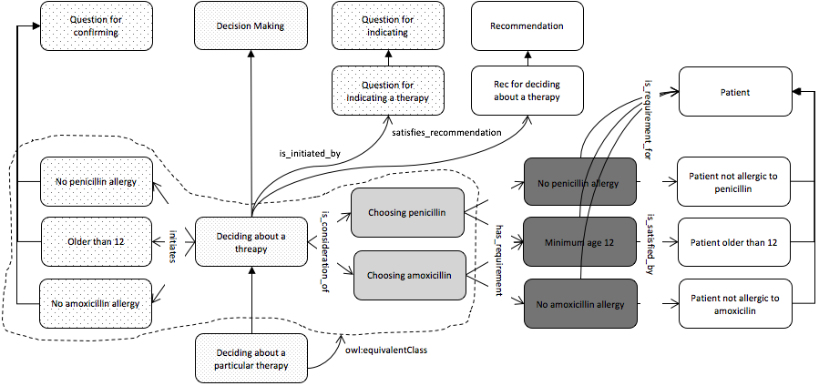
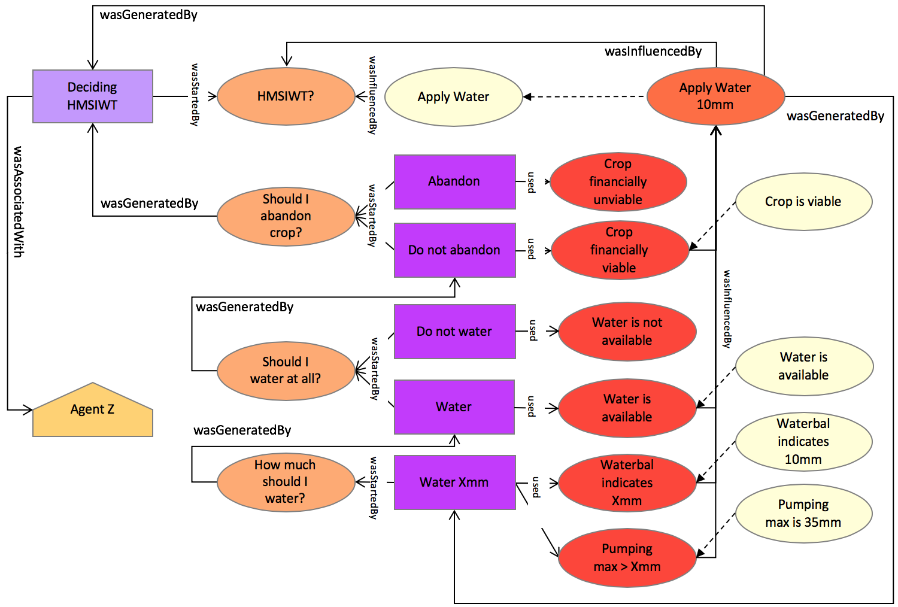
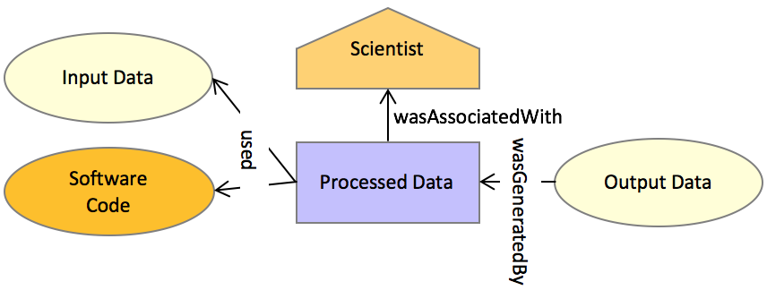
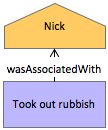
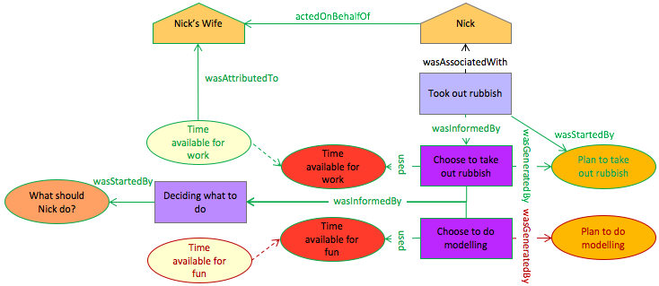

# Examples
These examples are slightly extended versions of the examples given in the MODSIM 2017 conference paper [Modelling causes for actions with the Decision and PROV ontologies](http://github.com/nicholascar/decprov-ont/blob/master/references/Car2017-Modelling-causes-for-actions-with-the-Decision-and-PROV-ontologies.pdf).

The first two example start with a Decision Ontology (DO) example, map them to PROV-O and finally render them in DecPROV. This is to indicate the progression of thinking in modelling from DO to DO+PROV-O to DecPROV. The final 3 examples are only given in DecPROV.

The examples in here use elements from the key in Figure 1.

  
**Figure 1**: element key for diagrams

## 1. Sore Throat

This example of DecPROV use extends the Bacterial Throat use example provided by the Decision Ontology (DO) upon which DecPROV is based. See the DO's ontology documentation for the original:

* [DO's Bacterial Throat Example](https://github.com/nicholascar/decision-o/blob/master/examples/03-bacterial-throat-infection.md)

### DO Original
In the DO' original example, a *normative* use scenario of the DO is given, as per Figure 2 below. Such a *normative* use scenario is intended to convey best practice and direct future throat infection decisions. 

**Figure 2**: A *normative* use scenario of the DO in which a physician is asked to determine a therapy for a patient presenting with a sore throat. Only the some of the decision options from the original scenario are shown for brevity.

Figure 2 includes decision Options and Requirements that indicate the therapies a physician should choose for a presenting patient, depending on facts about them such as their age, allergies etc.

### Provenance mapping of original

The DO caters for past decisions made with its so-called *data-driven* use scenarios. Figure 3 shows an extension to Figure 2 that includes and removes elements permitting its interpretation as a decision that has already happened.

**Figure 3**: A *data-driven* version of Figure 1.

In order to indicate a specific past decision that was made, Figure 3 includes only one Option that resulted in the selection of an answer for the original question (which therapy to choose). The particular therapy was Amoxicillin which waschosen based on the fact that the presenting patient, Patient X, was allergic to penicillin (another possible therapy) and not allergic to amoxicillin. Facts about Patient X are expressed by indicating that Patient X is a member of sets of the Patient class that include certain properties, such as penicillin allergy or patients with age greater than 12.

The selection of Amoxicillin as an outcome for this decision is *legal* or *correct* according to the DO due to Amoxicillin being a type of Therapy, the class of which was indicated as being the solution class for this type of problem.

Note that an additional Requirement has been added Figure 3 (in orange) to create dissjointness between the selection of penicillin and amoxicillin.

An Decision Maker has also been added to Figure 3 to indicated agency in making the decision. Few innovations have taken place in this mapping other than perhaps the mapping of DO's Option class to PROV-O's Activity class. This has been made due to an Option in DO resulting in the selection, or not, of an outcome which is akin to PROV-O's Activity generating, or not, an Entity. This is a different way of considering Options perhaps compared with DO's understanding of them as Situations in which an agent exists. There is no direct corrolate of a Situation in PROV-O, other than perhaps an Activity, however DO also contains a Process class which is more obviously a PROV-O Activity.

Figure 4 below shows an in-place mapping of the elements in Figure 3 to PROV-O.

**Figure 4**: Figure 3 elements mapped to PROV-O.

### DecPROV rendering

DecPROV does not include all of the classes of DO. Figure 5 below shows this sore throat example using only DecPROV classes. Note that the Answer Y from Figure 3 (and it's PROV-O version in Figure 4) is replaced with direct indications of the chosen therapy, Amoxicillin, as being the answer to the scenario's Question. Also, no Decision object is included in Figure 5. This is because DecPROV is able to accomplish the aims for which DO implemented a Decision class with use of the Answer class: a Question can have a target answer class (in this case a Therapy) and be answered by an Answer and the DecisionMaking process can be seen to have been completed correctly if the Answer objects is also a member of the taget class (as Amoxicillin is of Therapy here) without the further need of a Decision class to indicate DecisionMaking completion.

**Figure 5**: a DecPROV modelling of the Sore Throat example.

## 2. Irrigation Decision 

This example illustrates questions that give rise to further questions.

# DO original

Figure 6 shows a DO model of a decision about How much should I water today? (HMSIWT), a question faced daily by irrigation farmers (and gardeners!). The possible answer "Apply Water 0mm" is crossed out indicating that this Option was not chosen. It is included in the diagram for illustrative purposes only and wouldn't be present in a real data rendering of this decision.

**Figure 6**: DO's modelling of HMSIWT in which the original Question *initiates* further sub-questions, the answers of which either lead to a decision outcome or even further sub-questions.

Figure 7 shows a PROV-O-aligned version of Figure 6.

**Figure 7**: A PROV-O aligned version of Figure 6.

### DecPROV rendering

Figure 8 below shows a DecPROV rendering of this irrigation example. Note that in this DecPROV rendering, one of the OptionSelection Activities generated the Answer to the Question. The total DecisionMaking Activity can be seen as having generated this Answer too, given that the OptionSelection Activity is a sub Activity of it. Also, the facts that convinced Agent Z to choose this Answer are presented as the presence of Entities within the Requirements classes, i.e. individuals within certain sets. No individuals (facts/Entities) are present for the Requirement Water is not available. To further enhance this decision modelling, the class Water is not available could be indicated as being disjoint with Water is available, thus seeing an Entity present within Water is available and not seing one within Water is not available give a clear indication of what decision should be made since one Option has its Requirements sataisfied and the other does not.

**Figure 8**: A DecPROV rendering of this irrigation decision example.

## 3. Indicating why something was generated

### Simple indication

Figure 9 shows a simple data processing scenario, modelled in PROV-O, in which Output Data is generated by a Processed Data Activity. 

**Figure 9**: Diagram of a simple data procession scenario modelled in PROV-O

In order to indicate *why* the Output Data was generated, Figure 10 shows the addition to Figure 9 of DecPROV Question nd Answer class objects. Question X is shown to have started the Activity which lead to the generation of the Output Data. Question X is also shown to have influenced Answer Y. Textual information within Question X and Answer Y, perhaps associated using prov:value properties, may be included to make explicit what the circumstances of the Question and Answer were.

**Figure 10**: Figure 9 with DecPROV additions of Question and Answer objects

### Detailed indication

Figure 11 shows more detailed modelling about why the Output Data of Figure 9 was generated. In Figure 11, Question X that was posed both triggered a DecisionMaking Activity (K) as well as the Activity which processed the data. Details of actions and facts within the DecisionMaking Activity are then related using all the various classes of DecPROV. In this case, Fact R was presented that satisified Requirement Q pertinent to OptionSelection N. By "satisified" we mean that Fact R is a member of the set that Requirement Q represents. If multiple Requirements pertinent to OptionSelection N were present, for Fact R to satisfy them all, it would need to be a member of the intersction of all the Requirements. 

**Figure 11**: Figure 9 with many DecPROV additions

## 4. Indicating why particular inputs to a process were selected

In order to indicate why particular Input Data was used in the scenario related in Figure 9, we need to add DecPROV classes to the scenario that describe why that input was selected over other possible inputs. In Figure 12, a DecisionMaking Activity is shown to have taken place before the Processed Data Activity. The DecisionMaking Activity included two OptionSelection Activities, one of which selected Dataset B which was then taken as Input Data. Dataset A was perhaps a consideration but was ultimately not selected. Normal DecPROV modelling would not contain Dataset A in the graph of the scenario however it is indicated in Figure 12, in red, for illustrative purposes. As to the exact reasoning for the selection of Dataset B over Dataset A, that would be related by the various Requirements associated with the OptionSelection classes. One can infer in this case that Dataset B satisified Requirements X & Y pertinent to OptionSelection Choose Dataset B but that no Dataset was present that satisified Requirements W & X pertinent to Choose Dataset A. 

By Dataset B "satisifing" Requirements X & Y we mean that X & Y are classes and that Dataset B is a member of the intersection of those classes.

  
**Figure 12**: Figure 9 with DecPROV indicating input selection

## 5. Indicating why an Agent did something

Figure 13 tells us that an Agent performed an action: here Nick Took out rubbish.

  
**Figure 13**: PROV-O modelling showing an Agent did something

Figure 14 adds DecPROV elements to the scenario in Figure 13 indicating that before taking out the rubbish, Agent Nick faced the Question What should Nick do? and within the DecisionMaking triggered by that Question he faced two OptionSelection scenarios: one to Choose to do modelling with an associated Requirement that he have Time available for fun and another to Choose to take out the rubbish with an associated Requirement that he have Time available for work. Present within the DecisionMaking scenario was the fact that Time [was] available for work. Not present was the fact that Time [was] available for fun (shown in red for illustrative purposes, would not be present in a real DecPROV graph). Since only the Requirement that Time be available for work was satisified, the associated OptionSelection Choose to take out rubbish generated a Plan to take out rubbish which was the thing that started (caused) Nick to undertake that action. Since Time available for fun was not present, the Requirement for the OptionSelection Choose to do modelling was not satisified therefore no Plan to do modelling was generated (again shown here in red, would not be present in real data).

**Figure 14**: Figure 13 plus DecPROV elements indicating why a particular action was undertaken

What is not indicated in this scenario is any notion that the two plans - the actually generated plan to take out rubbish and the potential but ultimately not generated plan to do modelling - are actually unable to be undertaken simultaneously; that they are disjoint in some way, perhaps in time. This sort of modelling may be addressed in a future version of DecPROV.

Note that while Agent-to-Agent imerative for action are not modelled in DecPROV, it can be inferred from Figure 14 that the Agent Nick's Wife has some authority over Nick since facts generated by her caused a certain action on Nick's part. For such imperative modelling, see the [Agreements ontology](http://promsns.org/def/agr).

 