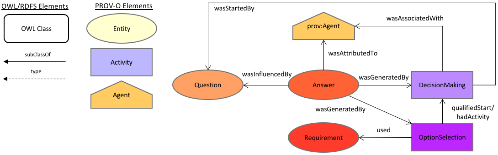

# DecProv-O
The Decision Provenance ontology

## Introduction
This ontology is derived from the [W3C Decisions and Decision-Making Incubator Group](https://www.w3.org/2005/Incubator/decision/)'s Decision Ontology (DO) which can be found at <https://github.com/nicholascar/decision-o>. It has been aligned with the W3C's [PROV ontology](https://www.w3.org/TR/prov-o/) since it is widely recognised that analysing the elements of decisions *post hoc* is an exercise in provenance.

## Ontology document
Namespace location:
* HTML: <http://promsns.org/def/decprov>
* RDF turtle: <http://promsns.org/def/decprov.ttl>

Local copies:
* HTML: [decprov.html](decprov.html)  
* RDF Turtle: [decprov.ttl](decprov.ttl)

## Ontology class diagram

All relationships are PROV-O relationships

## Modelling description
See [MODELLING](MODELLING.md) for a description of the choices made about classes in DecPROV, including why certain Decision Ontology classes were included, excluded or changed.

## Examples
See [EXAMPLES](EXAMPLES.md).

## Publications
* [Modelling causes for actions with the Decision and PROV ontologies (MODSIM 2017 conference)](http://github.com/nicholascar/decprov-ont/blob/master/references/Car2017-Modelling-causes-for-actions-with-the-Decision-and-PROV-ontologies.pdf)

## License
This ontology and all other content in this repository are licensed under the [Creative Commons Attribution 4.0 International (CC BY 4.0)](https://creativecommons.org/licenses/by/4.0/) (local copy of deed: [LICENSE](LICENSE)).

## Authors and Contact
**Nicholas Car**  
*Data Architect*  
Geoscience Australia  
<nicholas.car@ga.gov.au>  
<http://orcid.org/0000-0002-8742-7730>  
